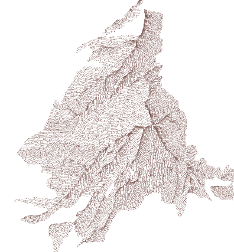

This is a linear symbolizer prototype developped in the course of the ANR [Mapstyle](http://mapstyle.ign.fr/) project (ANR-12-CORD-0025)

# [Online demo](http://mbredif.github.io/mapstyle)

# Datasets

- The [brush](tex/O4YINI0.jpg) textures have been [designed by Yurlick / Freepik](http://www.freepik.com)
- The [rail](tex/rail.png) and [checkerboard](tex/checkboard.png) textures may be used free of charge for whatever .
- The [shapefiles](data) are available under the Creative Commons Attribution Non-Commercial No Derivatives Licence [CC-BY-NC-ND-3.0](https://creativecommons.org/licenses/by-nc-nd/3.0/). Attribution should explicitly reference the "ANR MapStyle project (ANR-12-CORD-0025)" and the [NPAR](http://expressive.richardt.name/2016/NPAR/Home) publication :

Christophe S., Dumenieu B., Turbet J., Hoarau C., Mellado N., Ory J., Loi H., Masse A., Arbelot B., Vergne R., Brédif M., Hurtut T., Thollot J., Vanderhaeghe D. (2016). [Map Style Formalization: Rendering Techniques Extension for Cartography](https://hal.archives-ouvertes.fr/hal-01317403/document), Pierre Bénard; Holger Winnemöller. Expressive 2016 The Joint Symposium on Computational Aesthetics and Sketch-Based Interfaces and Modeling and Non-Photorealistic Animation and Rendering, May 2016, Lisbonne, Portugal. The Eurographics Association, Non-Photorealistic Animation and Rendering.  

# Dependencies

This prototype depends on the following js libraries:
- [Three.js](https://threejs.org/)
- [DAT.gui](https://github.com/dataarts/dat.gui)
- [stats.js](http://github.com/mrdoob/stats.js)
- [shp.js](https://github.com/kig/shp.js/)
